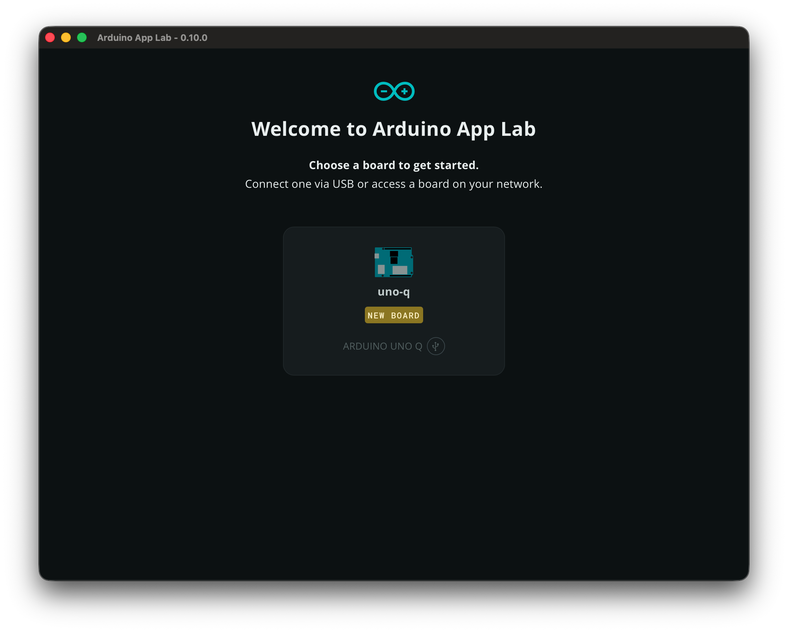
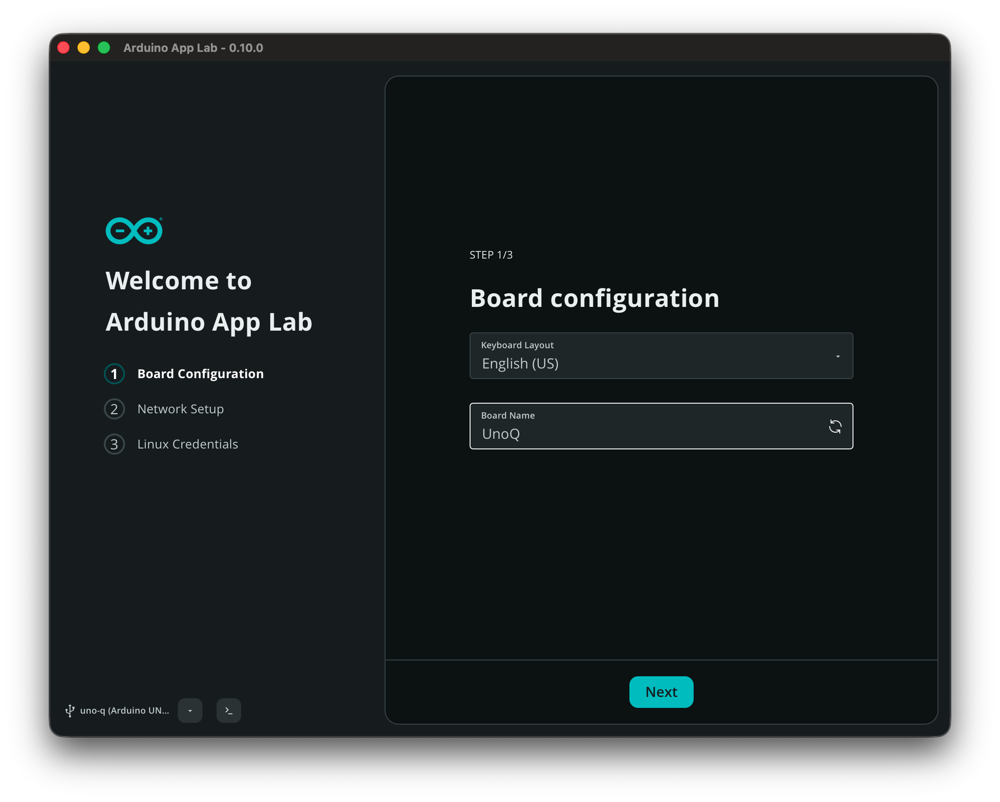
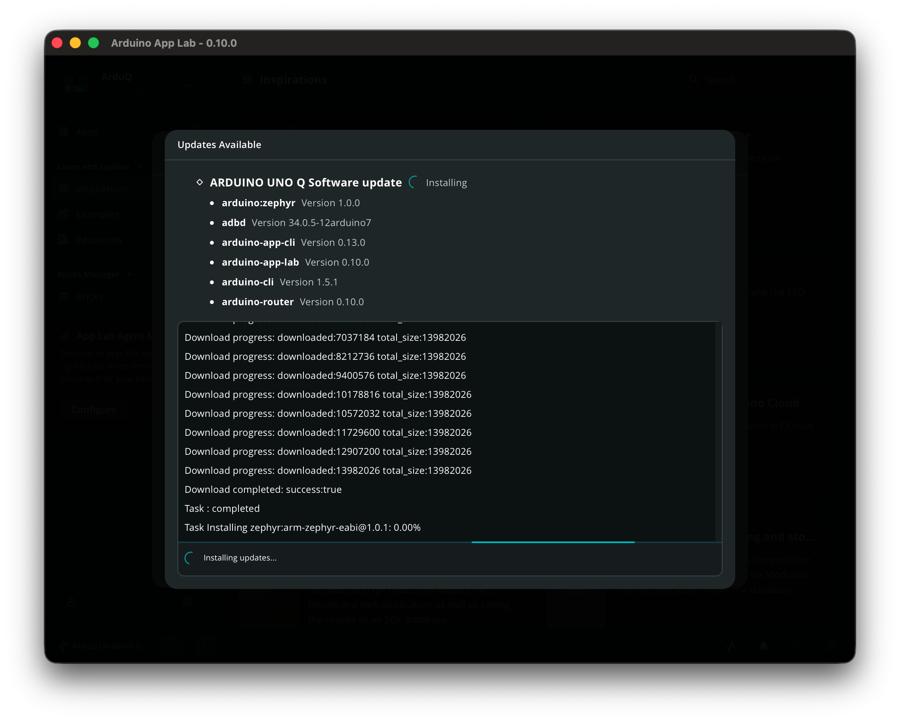
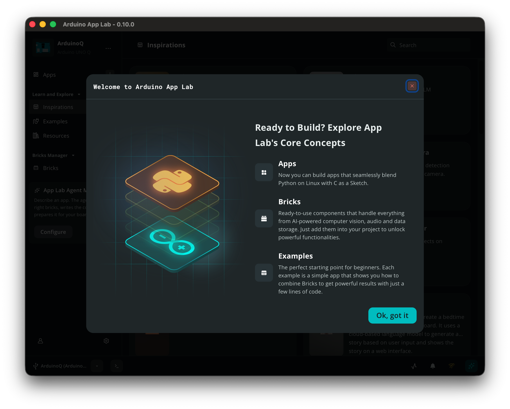
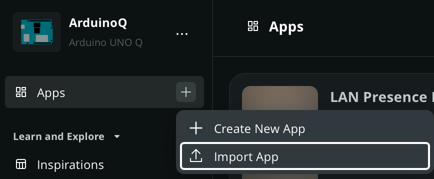
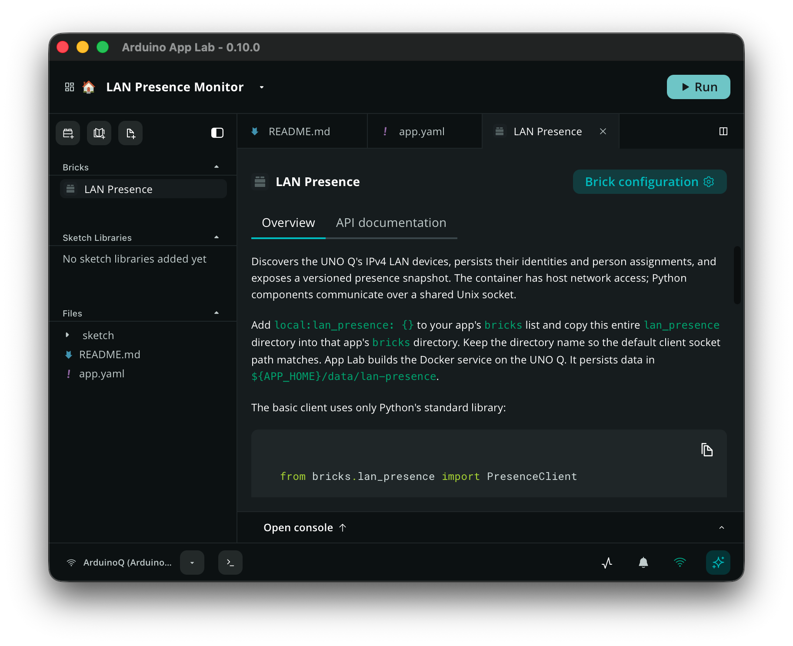
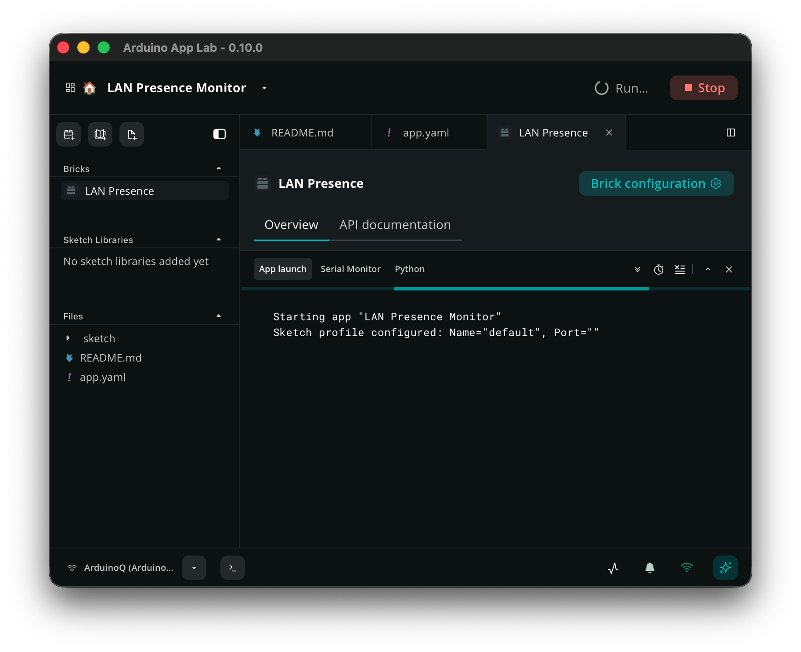
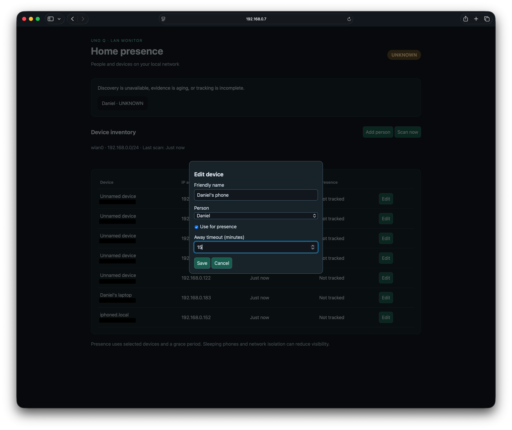
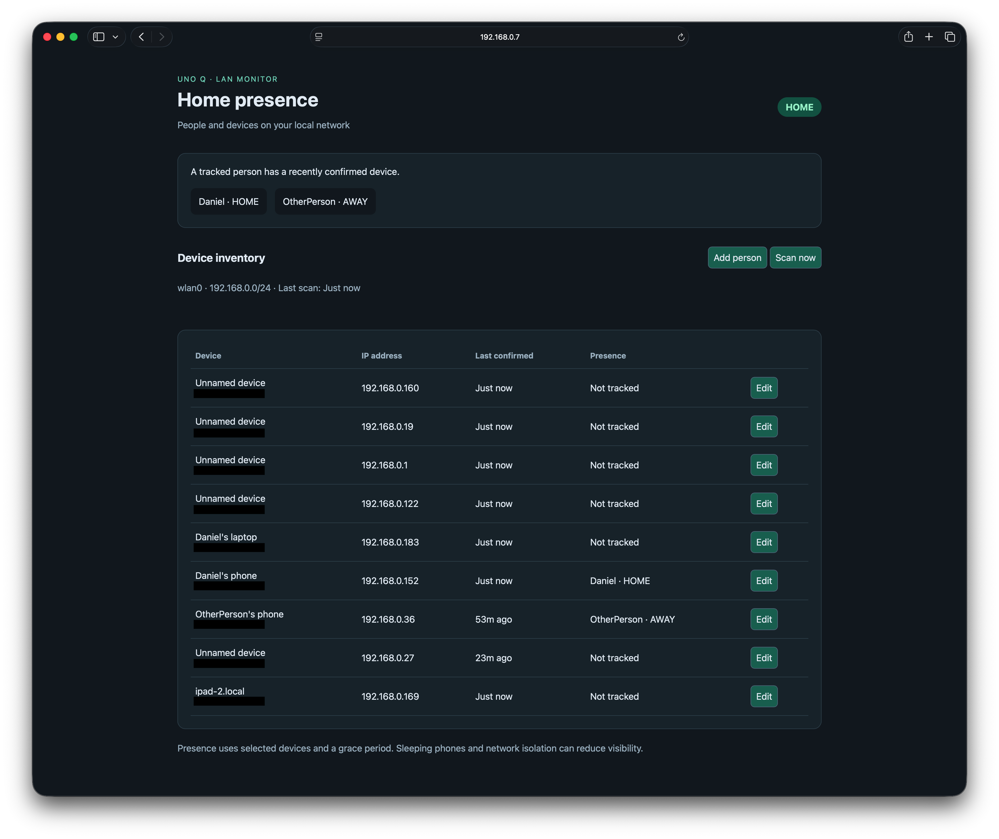
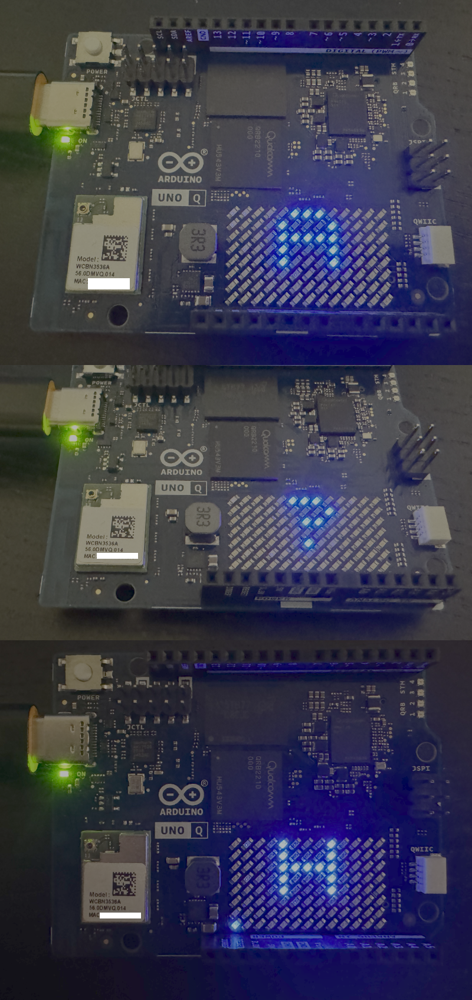

# Wireless sensing security system -- presence detection

Wireless sensing can be used to detect if members of a household are home. Using this information, the entire security system can be automated without human interaction. No need to enter a code or manually activate the system when leaving home. This project is achieving such a smart home security system with the Arduino UNO Q at the center thanks to its wireless connectivity. The device detects other wireless devices connected to the same local network as the Arduino. By utilizing multiple data sources, such as MAC addresses and mDNS hostnames, the presence of individuals can be automatically tracked, so arming and disarming the security system can be automated.

Automatic sensing of family member presence at home unlocks several automation opportunities not just for home security, but in other areas too. For example, automated appliance control can be achieved, allowing appliances to be turned off when nobody is at home, allowing significant energy savings. I built the project in a modular fashion to allow reusability of the wireless sensing logic in other areas too.

I originally intended to analyze wireless traffic too, however, external WiFi dongles were not recognized by the Uno Q and would have required additional steps to enable driver support, so that is out of the scope for this project.

## System architecture

The brain of the solution is the Arduino UNO Q. With its WiFi connectivity, it can not only connect to the internet, but it can also detect nearby devices by monitoring WiFi traffic. Nowadays, both WiFi and Bluetooth are constantly enabled in smartphones, so they constantly transmit data, based on which their presence can be detected with high precision. Based on the presence or lack of presence of nearby wireless devices, the smart security system can be armed automatically if all family members' devices leave the home. One Uno Q is enough even for larger homes where multiple wireless routers are present, since those usually connect devices to the same local network and thus are detectable by the Arduino Uno Q.

Based on local device data, it is also possible to detect unknown handsets on the network and use that as additional data points for the alarm system in the future, for example for detecting suspicious devices or unusual wireless traffic via anomaly detection methods.

The Arduino UNO Q is powerful enough to serve a web application on the local network for setup and monitoring (at port 8000). After setup, since the device automatically detects family member presence based on wireless signals, the goal is to not require manual action. In the web UI, the person-device mapping and presence detection source device should be set up. Please note that the web service running on the Uno Q has no login, though. Anyone on the local network can access it and can read MAC addresses, presence data, and edit assignments. It is designed to run on a somewhat trusted network at least.

The project itself is in the form of an Arduino App Lab app. It contains several python scripts responsible for:
 - Local webserver
 - SQLite database logic
 - Device detection
 - Presence detection

Most of the code is running inside a docker container, for which the dockerfile is located in [bricks/lan_presence/Dockerfile](./bricks/lan_presence/Dockerfile). The brick configuration is in [bricks/lan_presence/brick_config.yaml](./bricks/lan_presence/brick_config.yaml) and [bricks/lan_presence/brick_compose.yaml](./bricks/lan_presence/brick_compose.yaml). There is also an Arduino sketch responsible for driving the LED matrix of the Uno Q. 

The app discovers IPv4 devices through the built-in Wi-Fi, stores device/person assignments, serves a dashboard, and displays household presence on the LED matrix. 

To detect local devices, the service uses the host's network namespace to see `wlan0`, its addresses, and neighbours. It runs as UID 1000 with `NET_RAW` for ping. The service listens on a Unix socket in a shared data directory. App Lab's main Python container exposes port 8000 and proxies to that socket, so the main container does not need host networking.

The app also has mDNS hostname discovery using Python Zeroconf, so that human-readable names are fetched for at least some of the devices. Each scan queries DNS-SD service types for two seconds, then browses discovered and common service types for four seconds. IPv4 multicast uses only the selected LAN interface's addresses. Resolved `.local` hostnames are matched to known device IPs and stored as `hostname`. A limitation of this approach, though, is that the wireless devices must advertise a discoverable service to supply a name, and not every connected device does that.

There is a storage component as well, responsible for persisting device presence data, device-person associations, and presence history. A lightweight SQLite database is used for this purpose. All collected data are persisted in `data/lan-presence/presence.sqlite3` within the app folder on the Uno Q's file system. By default, even history is retained for 30 days and household transitions are kept for 90 days. Data older than this are cleaned up after successful scans.

To make it easier to import the project to the Arduino Uno Q, there is also a [script](./scripts/package_app.py) which packages the app's contents to a zip located in [dist/lan-presence.zip](./dist/lan-presence.zip). 

## Getting started

As mentioned earlier, the project uses an Arduino Uno Q. After unboxing the device, the first step is to download the [Arduino App Lab](https://docs.arduino.cc/software/app-lab/) and setting up the board after plugging it in to the computer via USB.

Once the device is detected, the setup process can begin for setting the device name, local password and connecting the board to WiFi.

After completion, a software update may also be needed:

Once that completes, reconnect the device and you should see the welcome screen of the app:

Now the device is ready to run the project.

## Running the app

After downloading the source code, either run the script on your machine to create the importable app zip ([script](./scripts/package_app.py)) or take the zip located in [dist/lan-presence.zip](./dist/lan-presence.zip) and import it in Arduino App Lab:

Before running, the LAN Presence brick variables in App Lab can be modified if needed:

Variable | Default value | Description
--- | --- | ---
`PRESENCE_INTERFACE` | `wlan0` | Built-in LAN interface
`PRESENCE_SCAN_INTERVAL` | `60` | Delay after each completed scan, seconds (minimum 10)
`PRESENCE_CONCURRENCY` | `32` | Concurrent ping processes, 1–64
`PRESENCE_MAX_HOSTS` | `1024` | Refuse larger subnets, configurable up to 4096
`PRESENCE_DEMO` | `0` | Set to `1` for synthetic devices without network probes
`PRESENCE_MDNS` | `1` | Discover .local hostnames directly over LAN multicast
`PRESENCE_LED` | `1` | Send household summary to the supplied MCU sketch

Then open the App and click the run button on the top right:

The app should then start. The first time it is run, it may take a while to build the docker image from the Dockerfile:

After it starts up, you can access the http interface by opening http://<arduino-ip-here>:8080 in any browser:

It is possible to add people, and then to assign devices on the network to them. If the checkbox for presence detection is ticked, that device will be used to determine if the person is away, or at home.

The basic logic of the app is as follows:
 - A successful ping or a `REACHABLE` neighbour entry in the Uno Q's system counts as presence.
 - A device is HOME for five minutes (or half its timeout, if shorter), UNKNOWN for the remainder of its grace period, then AWAY. The default away timeout is 30 minutes.
 - A person is HOME if any of their devices are HOME. They are AWAY if all of their devices are AWAY. Otherwise they are UNKNOWN.
 - A person with no selected devices is UNKNOWN. 
 - Top-level household presence uses the same aggregation across configured people as described above.
 - Failed/overdue scans and application restarts produce UNKNOWN state until discovery succeeds. 

The Uno Q itself also displays the top-level presence state on the LED matrix as well:

 **H** means HOME, **A** means AWAY, and **?** means UNKNOWN. One dot
on the bottom row represents each person at home (with a limit of 13 on the matrix). If Python/Bridge updates
stop for 15 seconds the display switches to the unknown state as a fallback.

## Using the collected data in other components

To provide as much flexibility as possible for reusability of the home presence component and data, the data is available through three different interfaces:

* **App Lab Python:** `PresenceClient().snapshot()` or the managed
  `LanPresence(on_update=callback)` brick.
* **HTTP:** `GET /api/snapshot`, `/api/devices`, `/api/devices/{id}`,
  `/api/people`, and `/api/people/{id}`.
* **MCU Bridge:** `presence_home_state`, `presence_people_home`,
  `presence_person_state`, `presence_device_state`, `presence_person_last_seen`,
  `presence_device_last_seen`, and `presence_device_mac`.

A snapshot contains device MAC/IP/name/owner, first and last seen timestamps,
last-seen age, tracking settings and state; people contain their linked device IDs,
tracked device IDs, state and last seen.

## A note on licenses

All third-party brands (including brand names, logos, trademarks and icons) remain the property of their respective owners. 
